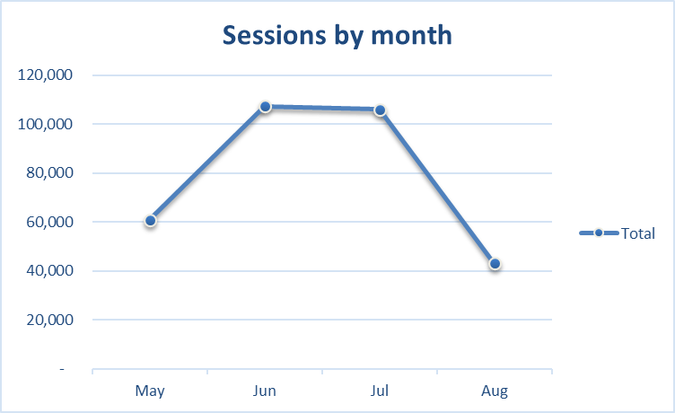
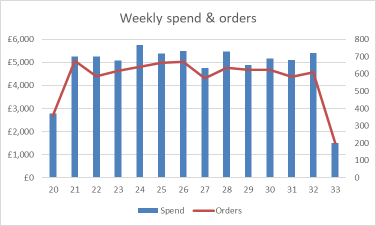

# Excel Marketing Analytics

## Introduction
This project analyses multi-channel marketing performance in Excel. Using daily sessions/clicks/spend and order-level revenue, the workbook builds pivots and KPIs to answer:
- Which channels drive the most orders and revenue?
- How efficient are we (CTR, CPC, CR, CAC, ROAS, AOV)?
- How do results trend by week and month?

## File in this repo
`excel_project.xlsx` — the complete workbook (pivots, formulas, and charts).  
This repository contains only the workbook; charts for the README are pasted inline below.
[Download the workbook](excel_project.xlsx)

## What’s inside the workbook
**Sheets (typical layout):**
- `sessions` — daily traffic by Channel/Source/Medium (sessions, clicks, spend, CTR, date, week, month)
- `orders` — order-level data (order date, items, revenue, channel attribution)
- `weekly_summary` — weekly rollups (spend, orders, revenue)
- `channel_summary` — pivoted channel KPIs (CR, AOV, CAC, ROAS, trend columns)
- `report` / `kpi_pivot` — a tidy report view referencing the pivots

**KPIs & formulas**
- CTR = `Clicks / Sessions`  
- CPC = `Adjusted Spend / Clicks`  
- CR  = `Orders / Sessions`  
- AOV = `Revenue / Orders`  
- CAC = `Adjusted Spend / Orders`  
- ROAS = `Revenue / Adjusted Spend`

> Paid channels use Adjusted Spend (to allow a CPC multiplier for scenario testing). Organic/Email/Referral have £0 spend; CAC and ROAS are not applicable for those.

**Excel features used**
- PivotTables and PivotCharts with slicers  
- Date functions (week number, month, EOMONTH)  
- Lookups/mappings for channel grouping  
- Conditional formatting for KPI thresholds

## Visuals

### Monthly trend
Sessions by month show seasonality and help spot tracking issues or partial months.

  
Sessions peaked in June/July before a sharp drop in August (likely seasonal or partial-month data).

### Weekly efficiency view
Overlay spend and orders to see how budget translates into conversions week to week.

  
Spend is fairly steady across weeks; orders fluctuate—investigate creative/landing page changes around weeks with dips.

## How to use the workbook
1. Open `excel_project.xlsx` (Excel 2019 / Microsoft 365 recommended).  
2. Go to **Data → Refresh All** to recalculate pivots.  
3. Use slicers (Channel/Month/Source) to explore segments.  
4. Optional scenario: adjust the **CPC multiplier** on the report sheet to see CPC/CAC/ROAS sensitivity.

## Results & insights

- Overall performance (from the workbook):  
  CR 2.54%, AOV £59.83, CAC £8.34, ROAS 7.17× on adjusted spend £67,303.

- Channel leaders:  
  - Best conversion: Email at 4.46% CR.  
  - Largest order driver: Organic Search — 2,744 orders, £166.8k revenue.  
  - Paid efficiency: Paid Social ROAS 3.53× vs Paid Search 3.23×; CAC £16.39 (Social) vs £18.54 (Search).

- Monthly trend (sessions):  
  May 60,920 → June 107,329 → July 106,122 → August 43,065.  
  August is materially lower — treat as a partial month or seasonal dip.

- Weekly spend → orders:  
  Correlation is very high (r = 0.978). Weeks 22, 24, and 32 under-delivered versus spend; Weeks 21 and 29 over-performed.  
  Action: review creatives/audiences/landing pages around under-performing weeks; check for tracking changes.

### Channel snapshot
| Channel         | Sessions | Orders | Revenue  | CR    | CAC   | ROAS |
|-----------------|---------:|-------:|---------:|:-----:|:-----:|:----:|
| Organic Search  | 93,998   | 2,744  | £166,835 | 2.92% |  —    |  —   |
| Paid Search     | 100,036  | 2,330  | £139,530 | 2.33% | £18.54| 3.23 |
| Paid Social     | 83,778   | 1,471  | £85,070  | 1.76% | £16.39| 3.53 |
| Email           | 25,513   | 1,138  | £67,425  | 4.46% |  —    |  —   |
| Referral        | 14,111   |   388  | £24,000  | 2.75% |  —    |  —   |

> CAC and ROAS are shown only for paid channels.

## Profit lens (assumptions and quick test)

Break-even ROAS:  
Assuming a 60% gross margin, break-even ROAS ≈ 1 / 0.60 = 1.67×.  
Both paid channels clear this (Search 3.23×, Social 3.53×).

Budget test (illustrative):  
Shift 10% of Paid Search spend (~£4.32k) to Paid Social at current CAC/AOV.  
Orders gained (Social) ≈ 263; orders lost (Search) ≈ 233 → net +30 orders.  
Revenue uplift ≈ £1,286; at 60% margin → ~£770 gross profit improvement (spend unchanged).

## Recommendations
1. Defend SEO (largest order and revenue driver).  
2. Scale Email programmes (highest CR).  
3. Paid mix: pilot a small budget reallocation from Search → Social (e.g., 10–15%) while monitoring CAC/ROAS and diminishing returns.  
4. Investigate under-performing weeks (22, 24, 32): creative fatigue, audience changes, landing pages, or tracking issues.  
5. Add a profit view to the workbook (margin input → compute POAS and contribution).
